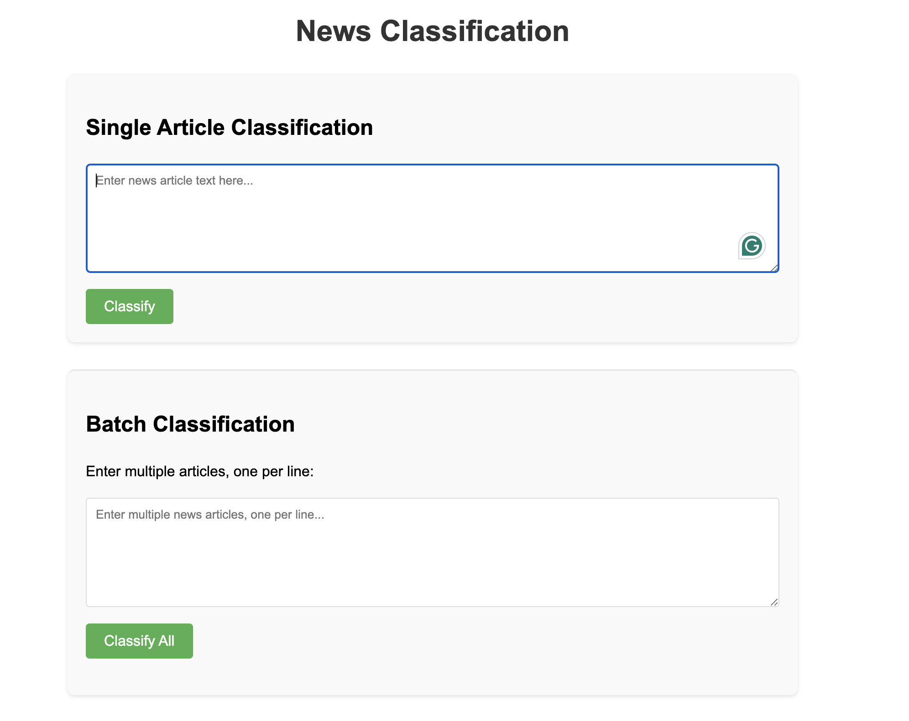

# simple news classification api

A FastAPI application that serves a HuggingFace transformer model to classify news articles into categories: World, Sports, Business, or Sci/Tech.

# User Interface


# Model Information
Text classification is a common NLP task that assigns a label or class to text. Some of the largest companies run text classification in production for a wide range of practical applications. In this use case, we classify news articles.

The model used: `distilbert/distilbert-base-uncased`

Summary of the model after training:

### Evaluation Metrics

| Metric                   | Value                |
|--------------------------|----------------------|
| Evaluation Loss          | 0.7610310912132263   |
| Evaluation Accuracy      | 0.75                 |
| Evaluation F1 Score      | 0.7443181818181819   |
| Evaluation Precision     | 0.7827380952380952   |
| Evaluation Recall        | 0.75                 |
| Evaluation Runtime (s)   | 0.1849               |
| Samples per Second       | 108.157              |
| Steps per Second         | 10.816               |
| Epoch                    | 2.0                  |

### Training Metrics

| Metric                   | Value                |
|--------------------------|----------------------|
| Training Runtime (s)     | 4771.0294            |
| Samples per Second       | 50.304               |
| Steps per Second         | 3.144                |
| Training Loss            | 0.1823235850016276   |
| Epoch                    | 2.0                  |

### Global Training Metrics

| Metric                   | Value                |
|--------------------------|----------------------|
| Global Step              | 15000                |
| Training Loss            | 0.1823235850016276   |
| Training Runtime (s)     | 4771.0294            |
| Samples per Second       | 50.304               |
| Steps per Second         | 3.144                |
| Total FLOPs              | 7948327403520000.0   |
| Epoch                    | 2.0                  |


## Project Structure

```
├── models/              # Model storage directory
├── images/              # images for the documentation
├── notebooks/           # Jupyter notebooks for model training/exploration
├── routes/
│   └── api.py           # API route definitions
├── src/
│   └── model_handler.py # Model serving logic
├── .gitignore           # Git ignore file
├── main.py              # FastAPI application entry point
└── README.md            # This file
```

## Prerequisites

- Python 3.8+
- PyTorch
- Transformers
- FastAPI
- Uvicorn

## Installation

1. Clone this repository
2. Install dependencies:

```bash

pip install -r requirements.txt
```

3. The model is served from the models directory. (or update the path in `src/model_handler.py`)

## Usage

1. Start the server:

```bash
python main.py
```

2. Access the API documentation at http://localhost:8000/docs or access using the main UI for testing purposes.

3. Example API requests:

```python
import requests
import json

# Single prediction
response = requests.post(
    "http://localhost:8000/api/predict",
    json={"text": "Gold prices have hit a new high, while the value of Bitcoin has also surged."}
)
print(json.dumps(response.json(), indent=2))

# Batch prediction
response = requests.post(
    "http://localhost:8000/api/batch-predict",
    json={"texts": [
        "Gold prices have hit a new high, while the value of Bitcoin has also surged.",
        "The national team won their match with a score of 3-1 yesterday.",
        "Scientists have discovered a new planet that might support life."
    ]}
)
print(json.dumps(response.json(), indent=2))
```

## API Endpoints

- `POST /api/predict` - Classify a single news article
- `POST /api/batch-predict` - Classify multiple news articles
- `GET /api/health` - Health check endpoint